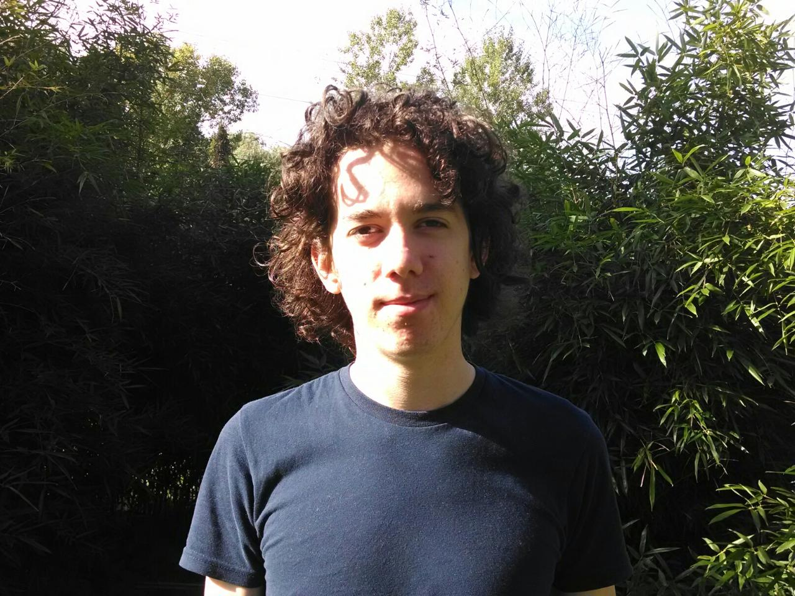

# About Me

My name is Kev Marleau and I'm a Math major with a minor in Computer Science. I have taken Computer Science I & II at SUNY New Paltz, but I consider most of my learning to have been self-taught. Linux has been my daily driver since high school and I have picked up a lot of knowledge from that. I have made small projects using Java, Python, HTML / CSS / Javascript, and R, although these have mostly been small scripts and novelties; I have yet to tackle a large project. I am also somewhat dabbled with a few other languages. I have a basic but functional understanding of git. I have no experience with database tools like SQL or particular Javascript frameworks.

I hope to gain from this class a better understanding of how to create functional and appealing websites. I would like to patch some of the many holes in my knowledge (frameworks, REST APIs, databases, security, performance, the list goes on...) as well as learn some best practices. I mostly want to make small personal site(s) for showcasing data science projects, math visualizations, and a variety of other pursuits. Some friends of mine also have projects I would like to assist with. Getting a job after college would be nice, too. In short, web development is a useful set of skills that I'm excited to hone.
